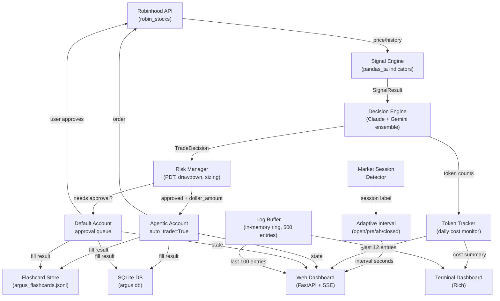
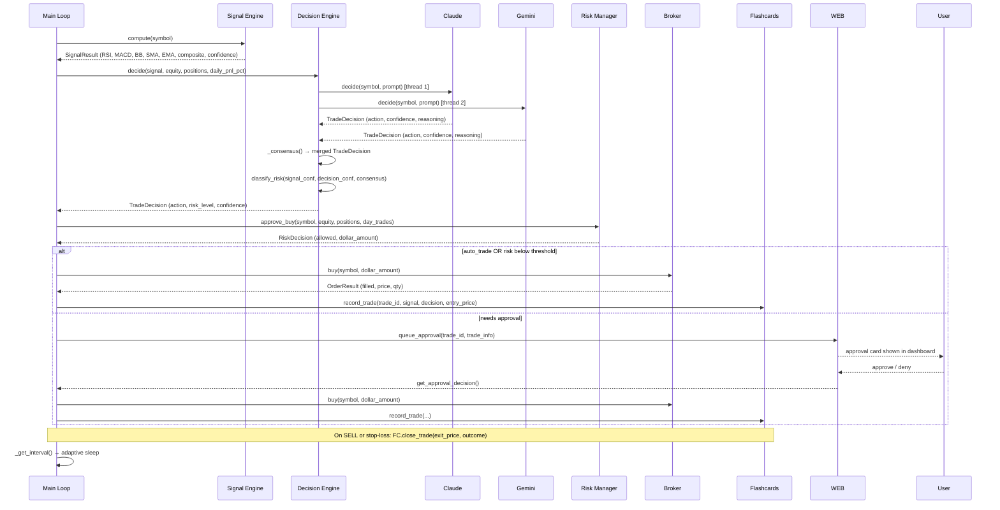
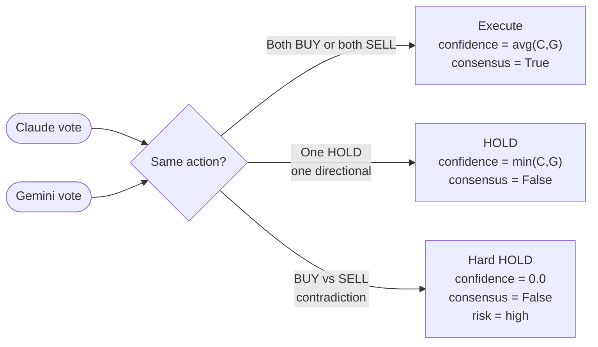
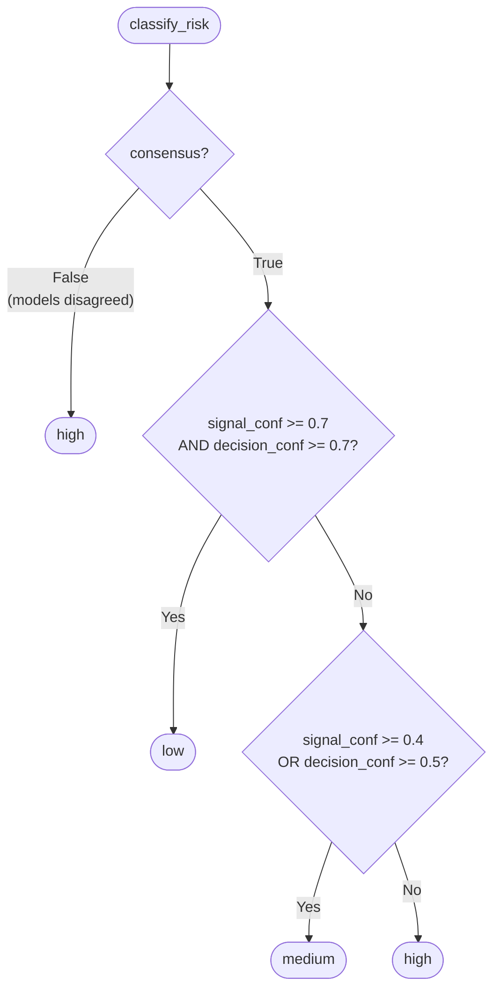
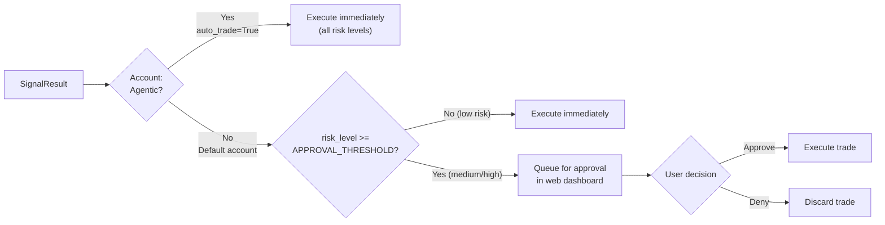

# Argus — Technical Documentation


## 1. What is Argus?

Argus is an automated AI trading agent for Robinhood that uses a **Claude + Gemini ensemble** to make BUY/SELL/HOLD decisions from technical indicator signals. It manages two Robinhood accounts simultaneously — one fully automated (Agentic) and one requiring human approval for higher-risk trades (Default) — and surfaces everything through a real-time web dashboard and a Rich terminal UI. All scan timing adapts automatically to the current NYSE market session, with per-session intervals configurable in `.env` and overridable live from the web dashboard.

---

## 2. Architecture Overview



The main loop (`Autopilot`) runs on an adaptive interval that changes with the NYSE market session. On each tick it detects the current session, computes signals once (market data is account-agnostic), then runs `_tick_account` independently for each configured account.

---

## 3. Trade Decision Flow



At the end of each tick the loop sleeps in 1-second increments so that the countdown timer updates cleanly and `SIGINT`/`SIGTERM` are handled without delay.

---

## 4. Ensemble AI Logic

Both models receive an identical prompt containing: symbol, current price, RSI, MACD, Bollinger Bands, SMA-20, EMA-50, portfolio equity, open position count, daily P&L, and whether the symbol is already held. They run in parallel via `ThreadPoolExecutor(max_workers=2)` with a 30-second timeout per model.

**Models:**
- Claude: `claude-opus-4-8` with `thinking: {"type": "adaptive"}` (extended thinking enabled)
- Gemini: `gemini-2.0-flash` at `temperature=0.2`

Each model returns strict JSON: `{"action": "BUY"|"SELL"|"HOLD", "confidence": 0.0-1.0, "reasoning": "..."}`.



If `GEMINI_API_KEY` is absent, Argus runs Claude solo with no confidence penalty. If Gemini initialization fails at startup it degrades gracefully to Claude-only mode with a `WARNING` log entry.

The combined reasoning string (prefixed `[Claude]` / `[Gemini]`) is stored in the flashcard and shown in the web dashboard's decision log.

---

## 5. Risk Classification

After ensemble consensus, `classify_risk()` maps signal and decision confidence into a risk tier:

| `consensus` | `signal_confidence` | `decision_confidence` | Risk Level |
|-------------|--------------------|-----------------------|------------|
| `False` | any | any | **high** |
| `True` | >= 0.7 | >= 0.7 | **low** |
| `True` | >= 0.4 OR decision >= 0.5 | — | **medium** |
| `True` | < 0.4 | < 0.5 | **high** |



On the **Default account**, trades with risk >= `APPROVAL_THRESHOLD` (default: `medium`) go to the approval queue instead of executing immediately. On the **Agentic account**, all three risk levels auto-execute.

---

## 6. Account Setup

Argus manages two accounts simultaneously. Each account has its own `RobinhoodBroker` instance, its own `RiskManager` (separate drawdown/PDT tracking), and its own pending approvals dict. A single-account fallback is available if neither account number is set.

| Account | Variable | Placeholder | Mode |
|---------|----------|-------------|------|
| Agentic | `AGENTIC_ACCOUNT_NUMBER` | `your_agentic_account_number` | Fully automated (`auto_trade=True`) |
| Default | `DEFAULT_ACCOUNT_NUMBER` | `your_default_account_number` | Approval required for `medium`+ risk |



Signals and price data are computed once per tick using a shared broker instance. The resulting `SignalResult` is fed to both account ticks independently so each account's risk state is fully isolated.

---

## 7. Adaptive Scan Intervals

Argus detects the current NYSE market session and applies a different scan interval for each phase. Intervals are set in `.env` and can be overridden for the current session via the web dashboard Controls card.

| Session | Time (ET) | Default Interval | Env Var |
|---------|-----------|-----------------|---------|
| Market open | 9:30 AM – 4:00 PM Mon–Fri | 90 s | `INTERVAL_OPEN` |
| Pre-market | 4:00 AM – 9:30 AM Mon–Fri | 180 s | `INTERVAL_PREMARKET` |
| After-hours | 4:00 PM – 8:00 PM Mon–Fri | 180 s | `INTERVAL_AFTERHOURS` |
| Closed / weekend | All other times | 300 s | `INTERVAL_CLOSED` |
| Fallback | Session detection failed | 300 s | `SCAN_INTERVAL_SECONDS` |

**Web dashboard override:** The Controls card contains a dropdown that sets a manual interval for the current session only. The override is cleared on restart and Argus reverts to adaptive logic. The API accepts any value >= 15 s, but the `.env` validator enforces a minimum of 30 s for non-override paths.

> ⚠️ Setting `INTERVAL_OPEN` below 90 seconds is not recommended. Each tick calls the Robinhood API for price data, runs Claude Opus (which may take 10–25 s with extended thinking), and optionally runs Gemini in parallel. Values below 90 s risk hitting API rate limits and may cause ticks to overlap.

---

## 8. Token Usage Monitor

Every Claude and Gemini API call records its token counts through `argus/dashboard/token_tracker.py`, a thread-safe singleton that resets at midnight.

**What is tracked:**

| Model | Tokens tracked | Pricing used for estimates |
|-------|---------------|---------------------------|
| Claude (`claude-opus-4-8`) | input, output, cache read | $15.00 / $75.00 / $1.50 per million tokens |
| Gemini (`gemini-2.0-flash`) | input, output | $0.10 / $0.40 per million tokens |

Costs are **estimates** based on public pricing at the time of release. Check the Anthropic and Google AI pricing pages for current rates before using these figures for budgeting.

**Where to see it:**

- **Web dashboard** — "Token Usage Today" card shows per-model call counts, token totals, and USD cost estimates, updated live via SSE.
- **Terminal dashboard** — A compact cost summary line appears in the header beneath the mode/session badges: `Claude $X.XXXX · Gemini $X.XXXX · Total $X.XXXX`.
- **JSON API** — `GET /api/status` response includes a `token_usage` key with the full summary dict.

The tracker resets automatically when the date changes. There is no persistent storage of historical daily costs — the counter is in-memory only.

---

## 9. Configuration Reference

Non-secret settings live in `.env` (copy from `.env.example`). Secrets use the OS keychain (see §10).

### Trading Mode

| Variable | Default | Description |
|----------|---------|-------------|
| `PAPER_TRADE` | `true` | `true` = simulated orders. Set `false` for live trading. |
| `APPROVAL_THRESHOLD` | `medium` | Minimum risk level requiring human approval on the Default account (`medium` or `high`). |

### Accounts

| Variable | Default | Description |
|----------|---------|-------------|
| `ROBINHOOD_USERNAME` | — | Robinhood login email (required). |
| `AGENTIC_ACCOUNT_NUMBER` | — | Robinhood account number for the fully automated account. |
| `DEFAULT_ACCOUNT_NUMBER` | — | Robinhood account number for the approval-gated account. |

### Risk Guardrails

| Variable | Default | Description |
|----------|---------|-------------|
| `MAX_POSITION_PCT` | `0.10` | Max fraction of equity in a single position (must be 0–0.25). |
| `STOP_LOSS_PCT` | `0.05` | Hard stop-loss trigger; position closed if price drops this fraction from entry. |
| `MAX_POSITIONS` | `5` | Max concurrent open positions per account. |
| `DAILY_DRAWDOWN_LIMIT` | `-0.05` | Kill switch threshold; stops all trading if session equity drops this fraction (must be negative). |

### Watchlist

| Variable | Default | Description |
|----------|---------|-------------|
| `WATCHLIST` | `AAPL,TSLA,NVDA,BTC,ETH` | Comma-separated symbols to scan on each tick. |

### Adaptive Scan Intervals

| Variable | Default | Description |
|----------|---------|-------------|
| `INTERVAL_OPEN` | `90` | Seconds between ticks during regular market hours (9:30 AM – 4:00 PM ET). |
| `INTERVAL_PREMARKET` | `180` | Seconds between ticks during pre-market (4:00 AM – 9:30 AM ET). |
| `INTERVAL_AFTERHOURS` | `180` | Seconds between ticks during after-hours (4:00 PM – 8:00 PM ET). |
| `INTERVAL_CLOSED` | `300` | Seconds between ticks when the market is closed or on weekends. |
| `SCAN_INTERVAL_SECONDS` | `300` | Fallback interval used if session detection fails. Minimum 30 s. |

### Web Dashboard

| Variable | Default | Description |
|----------|---------|-------------|
| `WEB_HOST` | `127.0.0.1` | Bind address; use `0.0.0.0` only behind an auth proxy. |
| `WEB_PORT` | `8000` | Port for the FastAPI web server. |
| `DATABASE_URL` | `sqlite:///argus.db` | SQLAlchemy connection string for trade history. |

### Notifications

| Variable | Default | Description |
|----------|---------|-------------|
| `NOTIFY_EMAIL` | — | Recipient address for email alerts. |
| `SMTP_HOST` | `smtp.gmail.com` | SMTP server host. |
| `SMTP_PORT` | `587` | SMTP port. |
| `SMTP_USER` | — | SMTP login (sender address). |
| `TWILIO_ACCOUNT_SID` | — | Twilio Account SID for SMS alerts. |
| `TWILIO_FROM` | — | Twilio source phone number (E.164 format). |
| `TWILIO_TO` | — | Destination phone number for SMS (E.164 format). |
| `SLACK_CHANNEL` | `#argus-alerts` | Slack channel for trade notifications. |

---

## 10. Secrets & Keychain

Secrets are never stored in `.env` or committed to source control. Argus uses the OS keychain (macOS Keychain, Windows Credential Manager, or Linux Secret Service via `keyring`). On startup, `config.py` loads secrets through `_KeychainSource` before falling through to `.env`.

**Priority order (highest to lowest):** environment variable → OS keychain → `.env` → default

Run `argus-setup` once after install to populate the keychain interactively. Re-run any time to rotate a key.

```
argus-setup           # store / update all secrets (interactive prompts)
argus-setup --show    # display which secrets are stored (values masked)
argus-setup --clear   # remove all Argus secrets from keychain
```

| Key | Required | Description |
|-----|----------|-------------|
| `ANTHROPIC_API_KEY` | **Required** | Anthropic API key for Claude Opus. |
| `GEMINI_API_KEY` | Optional | Google Gemini API key; omit to run Claude-only. |
| `ROBINHOOD_PASSWORD` | **Required** | Robinhood account password. |
| `ROBINHOOD_MFA_SECRET` | Optional | TOTP secret for Robinhood 2FA (base32 string from the authenticator setup page). |
| `SMTP_PASSWORD` | Optional | Gmail app password or SMTP credential for email alerts. |
| `TWILIO_AUTH_TOKEN` | Optional | Twilio auth token for SMS notifications. |
| `SLACK_BOT_TOKEN` | Optional | Slack bot token (`xoxb-...`) for channel notifications. |

> ⚠️ MFA sessions are never persisted to disk (`store_session=False`). The TOTP secret is cleared from memory immediately after generating the login code.

---

## 11. CLI Commands

These shell functions are defined in `~/.zshrc` and require `ARGUS_DIR` to point to the project root.

| Alias | Description |
|-------|-------------|
| `argus-tmux` | **Start here.** Creates (or re-attaches to) a `tmux` session named `argus` running the full terminal UI and web dashboard. Re-run from any terminal to re-attach. |
| `argus-start` | Foreground start with terminal UI. Exits when the terminal closes. |
| `argus-bg` | Background start (no terminal UI). Logs to `~/argus.log`. Writes PID to `~/argus.pid`. |
| `argus-restart` | Stops Argus and immediately restarts it in tmux. Equivalent to `argus-stop && sleep 1 && argus-tmux`. |
| `argus-stop` | Graceful shutdown. Kills by PID file, port 8000 process, and process name — works regardless of how Argus was started. |
| `argus-status` | Checks if Argus is running by polling `/api/status`. Prints equity and P&L if up, or a start instruction if down. |
| `argus-log` | `tail -f ~/argus.log` — follows the live log file for `argus-bg` and `argus-tmux` runs. |
| `argus-open` | Opens `http://127.0.0.1:8000` in the default browser. |
| `argus-mock` | Runs `dev_mock.py` — a fake-data UI server for development. No Robinhood connection required. |
| `argus-setup` | Launches the interactive keychain setup wizard to store or rotate secrets. |

---

## 12. Web Dashboard

The dashboard is a single-page app served by FastAPI at `http://127.0.0.1:8000`. State is pushed from the main loop to the browser via **Server-Sent Events** (`/events`) on every tick, so all panels update live without client-side polling. On first connect the browser receives a snapshot of the latest state immediately.

### Account Panels

Two side-by-side cards, one per account. **Agentic** uses cyan borders; **Default** uses purple (magenta). Each panel shows: equity, daily P&L (absolute and percent), day trade count (highlighted yellow at 2/3), mode (`AUTO` vs `APPROVAL`), pending approval count, open positions (entry/current price, unrealized P&L %), and the five most recent trades (time, side, fill price).

### Price Chart

Interactive chart for any watchlisted symbol. Pulls one month of daily OHLCV data from Robinhood via `GET /api/chart/{symbol}`. Features:

- **Candlestick / Line toggle** — switch rendering style without reloading data.
- **Linear regression prediction line** — trend projection overlaid on the chart.
- **Trade markers** — buy and sell executions from the current session plotted as arrows directly on the chart.

### Pending Approvals

Yellow cards appear for every Default-account trade queued for approval. Each card shows: symbol, dollar amount, risk level, AI confidence, signal direction, and the full AI reasoning from both models. Buttons: **Approve** (`POST /api/approve/{trade_id}`) or **Deny** (`POST /api/deny/{trade_id}`). The main loop polls for decisions on every tick and executes approved trades immediately.

### Open Positions

Table of all open positions across both accounts showing: symbol, account label, quantity, entry price, current price, stop-loss price, and unrealized P&L %. A **Force Close** button sends `POST /api/close/{symbol}` to the main loop for immediate execution.

### Signals

Latest `SignalResult` for every watchlisted symbol: price, RSI, MACD histogram, composite direction (BULLISH / BEARISH / NEUTRAL, color-coded), and signal confidence.

### Recent Trades

Chronological list of executed buy/sell orders from the current session: time, symbol, account label, side, quantity, and fill price.

### Token Usage Today

Card showing per-model API usage since midnight: call count, input tokens, output tokens (and cache-read tokens for Claude), and estimated USD cost. Resets automatically at midnight. The total combined cost is shown at the bottom of the card.

### Decision Flashcards

A grid of cards from `argus_flashcards.jsonl`. Each card shows the market context at decision time on the front (symbol, signal composite, RSI, MACD histogram, Bollinger Band position). Click any card to expand the full AI reasoning, risk level, entry price, and — if the trade is closed — exit price, P&L %, and hold duration.

### Agent Log

Real-time log tail (last 100 entries) from the in-memory ring buffer. Color-coded by level: INFO (white), WARNING (yellow), ERROR (red). Auto-scrolls to the latest entry. Filterable by log level via a dropdown in the card header.

---

## 13. Flashcard Learning System

Every executed trade (buy or sell) produces a flashcard. Cards are stored in `argus_flashcards.jsonl` (one JSON object per line) in the project root. The `FlashcardStore` loads all cards into memory at startup and flushes the full file to disk on every write.

**On trade entry (`FlashcardStore.record_trade`)**, the card captures:

| Field | What it records |
|-------|----------------|
| `signal_composite` | `bullish` / `bearish` / `neutral` at decision time |
| `signal_confidence` | Fraction of indicators in agreement (0–1) |
| `rsi` | RSI-14 value |
| `macd_hist` | MACD histogram value (sign indicates momentum direction) |
| `bb_position` | `above_upper` / `below_lower` / `inside` |
| `price_vs_sma20` | `above` or `below` the 20-day simple moving average |
| `price_vs_ema50` | `above` or `below` the 50-day exponential moving average |
| `risk_level` | `low` / `medium` / `high` from the ensemble |
| `decision_confidence` | Averaged AI confidence (0–1) |
| `reasoning` | Full concatenated Claude + Gemini reasoning |
| `entry_price` | Actual fill price |
| `dollar_amount` | Position size in dollars |

**On trade close (`FlashcardStore.close_trade`)**, the card is updated with:

| Field | What it records |
|-------|----------------|
| `exit_price` | Fill price on sell or stop-loss |
| `pnl_pct` | `(exit - entry) / entry * 100` |
| `outcome` | `win`, `loss`, or `stop-loss` |
| `hold_duration_hours` | Time from entry to exit in fractional hours |

**Aggregate stats** are available via `FlashcardStore.summary()` — win rate, average P&L %, best trade, and worst trade — displayed in the web dashboard flashcard panel header.

For custom analysis, load the JSONL file directly:

```python
import json
from pathlib import Path

cards = [json.loads(l) for l in Path("argus_flashcards.jsonl").read_text().splitlines() if l]
closed = [c for c in cards if c["pnl_pct"] is not None]

# Example: which RSI ranges correlate with wins?
wins = [c for c in closed if c["pnl_pct"] > 0]
```

Look for patterns in: which `bb_position` + `signal_composite` combinations win most, whether high `decision_confidence` predicts positive P&L, and which symbols produce the best outcomes.

---

## 14. Paper Mode vs Live

### Paper Mode (`PAPER_TRADE=true`)

- Each account broker starts with a simulated `$10,000` cash balance (separate per broker instance).
- `buy()` deducts from the simulated balance and records a synthetic position; `sell()` returns proceeds to the balance.
- Price data is still fetched live from Robinhood for realistic signal computation.
- Orders never reach Robinhood's order management system.
- All other features (flashcards, signals, approvals, notifications, database, token tracker) work identically to live mode.

### Live Mode (`PAPER_TRADE=false`)

- Each account broker authenticates to Robinhood at startup using real account credentials.
- `buy()` calls `rh.orders.order_buy_fractional_by_quantity` (equities) or `order_buy_crypto_by_quantity` (crypto).
- Fractional shares are supported, so any dollar amount works regardless of share price.
- Sessions are never cached to disk (`store_session=False`). The TOTP code is computed fresh each startup and the MFA secret is cleared from memory immediately after.

### Go-Live Checklist

Before setting `PAPER_TRADE=false`, verify all of the following in paper mode:

- [ ] At least 5 full trading days completed without crashes
- [ ] Win rate >= 50% across >= 10 closed trades (`argus_flashcards.jsonl`)
- [ ] Kill switch has triggered and recovered correctly at least once
- [ ] Approval flow on Default account tested end-to-end (both approve and deny paths)
- [ ] Stop-loss sweep confirmed to close positions automatically
- [ ] `argus-status` shows correct equity and P&L after each session
- [ ] Notifications (email / SMS / Slack) delivering correctly
- [ ] `DAILY_DRAWDOWN_LIMIT` set conservatively (e.g., `-0.02` for the first live week)

> ⚠️ Start with the Agentic account (smaller balance) for the first live week before trusting the Default account's approval flow with larger positions.

---

## 15. Directory Structure

```
argus/
├── .env                          # Non-secret config (copy from .env.example)
├── .env.example                  # Template with all supported variables
├── pyproject.toml                # Package definition and dependencies
├── argus.db                      # SQLite trade history (created at runtime)
├── argus.log                     # Rolling log file (created at runtime)
├── argus_flashcards.jsonl        # Trade decision flashcards (created at runtime)
│
└── argus/                        # Main package
    ├── __init__.py               # Package version (__version__ = "0.4.0")
    ├── main.py                   # Autopilot orchestration loop; AccountContext; market session detection
    ├── config.py                 # Pydantic settings; keychain source; priority chain
    ├── secrets.py                # OS keychain read/write via keyring
    ├── setup_secrets.py          # argus-setup interactive CLI
    ├── install_service.py        # argus-service macOS launchd / systemd installer
    │
    ├── agent/
    │   └── decision.py           # DecisionEngine; _ClaudeEngine; _GeminiEngine; classify_risk()
    │
    ├── broker/
    │   └── robinhood.py          # RobinhoodBroker; paper simulation; live order execution
    │
    ├── strategy/
    │   └── indicators.py         # SignalEngine; SignalResult; pandas_ta indicator computation
    │
    ├── risk/
    │   └── manager.py            # RiskManager; PDT tracking; drawdown kill switch; stop-loss
    │
    ├── dashboard/
    │   ├── web.py                # FastAPI app; SSE stream; approval queue; REST endpoints; HTML UI
    │   ├── terminal.py           # Rich terminal dashboard; per-account panels; signals table; log panel
    │   ├── token_tracker.py      # Thread-safe daily token + cost tracker; resets at midnight
    │   ├── log_buffer.py         # In-memory log ring buffer (500 entries); logging handler installer
    │   └── server.py             # Standalone web-only entry point (no main loop)
    │
    ├── learning/
    │   └── flashcards.py         # FlashcardStore; Flashcard dataclass; JSONL persistence
    │
    ├── notifications/
    │   └── notifier.py           # Notifier; email (aiosmtplib); SMS (Twilio); Slack
    │
    └── storage/
        └── models.py             # SQLAlchemy models: Trade, Signal, Position, DailyStats
```
