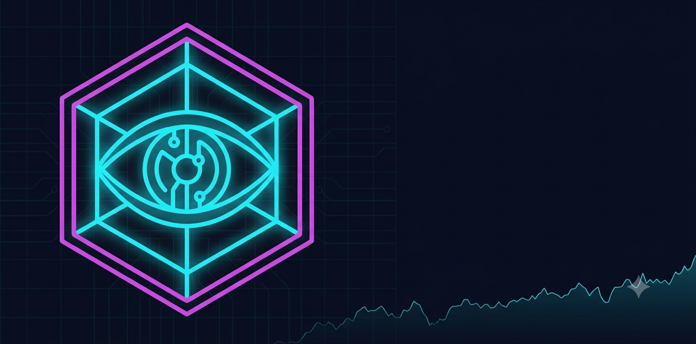

# Argus — AI Trading Agent for Robinhood




Argus is a personal AI trading agent that runs on your computer and watches your Robinhood account 24/7. It uses **Claude + Gemini** to decide when to buy and sell, enforces automatic stop-losses, and shows everything in a live web dashboard.

> ⚠️ **Disclaimer:** This is a personal project shared for educational purposes. It is not financial advice. Automated trading carries real risk of loss. Start in paper trading mode (the default) and only switch to real money if you understand what you're doing.

---

## What it does

- **Scans your watchlist** every 90 seconds during market hours, computing RSI, MACD, Bollinger Bands, and moving averages on each symbol
- **Asks Claude and Gemini** to vote BUY / SELL / HOLD — a trade only executes when both models agree and confidence is above your threshold
- **Enforces risk limits** automatically — stop-loss %, max dollar loss per position, max open positions, daily drawdown kill switch
- **Discovers opportunities** beyond your watchlist — pulls Robinhood's 100 Most Popular, daily movers, and upcoming earnings stocks every morning
- **Two accounts:** one fully automatic (Agentic), one that asks for your approval before each trade (Default)
- **Paper trading by default** — no real money moves until you flip a switch
- **Web dashboard** at `localhost:8000` with live charts, positions, P&L, and an AI decision log

---

## Quick start

### 1. Prerequisites

- Python 3.11 or newer
- A Robinhood account
- An [Anthropic API key](https://console.anthropic.com) (Claude) — required
- A [Google Gemini API key](https://aistudio.google.com) — optional, enables the two-model ensemble

### 2. Install

```bash
git clone https://github.com/ErickZBrambila/argus.git
cd argus
python3.11 -m venv .venv
source .venv/bin/activate        # Windows: .venv\Scripts\activate
pip install -e .
```

### 3. Run the setup wizard

```bash
argus-setup-gui
```

This opens a browser wizard that walks you through:
- Robinhood credentials (stored in your OS keychain, never written to disk in plain text)
- Account numbers (find them in Robinhood → Settings → Account)
- Watchlist picker
- Risk settings (stop-loss, max position size, etc.)


### 4. Start Argus

```bash
argus
```

Then open **http://localhost:8000** in your browser.

---

## Finding your Robinhood account number

1. Open the Robinhood app or website
2. Go to **Account** → **Settings** → **Account information**
3. Your account number is a 9-digit number (e.g. `462038597`)

If you only have one Robinhood account, enter the same number for both Agentic and Default.

---

## Two account modes

| Mode | What it does |
|------|-------------|
| **Agentic** | Trades fully automatically — no approval needed |
| **Default** | Shows a card in the dashboard for each trade, waits for you to approve or deny |

Start with Default if you want to review every decision. Switch to Agentic once you trust the system.

---

## Paper vs live trading

Argus starts in **paper trading mode** — all orders are simulated at real market prices. Nothing touches your real money. The dashboard shows paper positions, P&L, and trade history exactly as it would in live mode.

When you're ready to trade real money:
1. Run enough paper trades to trust the system (the **Go-Live Readiness Scorecard** in the Performance tab tracks this)
2. Open `.env` and change `PAPER_TRADE=true` to `PAPER_TRADE=false`
3. Restart Argus

---

## Go-Live Readiness Scorecard

The Performance tab shows when Argus is ready for real money. It requires:

- ✅ At least 30 closed paper trades
- ✅ Profit factor ≥ 1.5× (gross wins / gross losses)
- ✅ High-confidence trades outperform low-confidence ones
- ✅ Paper profit exceeds total Claude + Gemini API costs
- ✅ Both AI models independently vote "go live"

All five green = ready. Until then, keep paper trading.

---

## Dashboard

Open **http://localhost:8000** after starting Argus.

| Panel | What it shows |
|-------|--------------|
| Account cards | Equity, daily P&L, open positions, recent trades |
| Price charts | One month of candlesticks with SMA/EMA overlays and your trade markers |
| Pending approvals | Trades waiting for your OK (Default account) |
| Signals | Latest RSI, MACD, and composite direction per symbol |
| Decision log | AI reasoning for every decision, live |
| Performance tab | Win rate, profit factor, AI calibration, Go-Live Scorecard |

---

## Risk guardrails

These are set during setup and enforced automatically — the AI cannot override them.

| Setting | Default | What it does |
|---------|---------|-------------|
| Max position size | 10% | Max fraction of your portfolio in a single trade |
| Stop-loss | 5% | Sells automatically if a position drops this much from entry |
| Max dollar loss | $75 | Hard cap — position closed immediately if dollar loss hits this |
| Max open positions | 5 | Won't open new trades if you already have this many |
| Min AI confidence | 65% | Both models must be at least this confident to execute |
| Daily drawdown limit | −5% | Stops all trading for the day if portfolio drops this much |

---

## Configuration

Settings live in `.env` in the project root. Re-run `argus-setup-gui` to change them through the wizard, or edit the file directly.

Secrets (passwords, API keys) are stored in your OS keychain — never in `.env`.

---

## API costs — you will be billed

Argus calls Claude and Gemini on every scan tick. **These are paid APIs billed to your account** — not free.

| Service | What you pay | Where to set a budget |
|---------|-------------|----------------------|
| **Claude (Anthropic)** | ~$0.50–$2.00 per trading day | [console.anthropic.com/settings/limits](https://console.anthropic.com/settings/limits) |
| **Gemini (Google)** | ~$0.50–$2.00 per month | [aistudio.google.com](https://aistudio.google.com) |

**Monthly estimate for a typical setup:**
- 5-symbol watchlist, 90s scan interval → ~**$10–$20/month** (Claude) + <$1 (Gemini)
- 15-symbol watchlist → ~**$30–$60/month** (Claude)

Cost scales with watchlist size and how active the market is. During quiet sessions Claude does fewer calls (signal debouncing skips the LLM if nothing changed). During busy earnings seasons it calls more often.

**How to control costs:**
1. Set a monthly budget during setup — Argus shows a warning in the dashboard when you're approaching it
2. Keep your watchlist focused — every extra symbol adds ~5–10% more Claude spend
3. Gemini Flash is nearly free — always worth enabling for the second opinion

**Argus tracks your spend live:** the "Token Usage Today" card in the dashboard shows exact call counts, token totals, and USD cost updated in real time.

---

## Notifications

Argus can push trade alerts to your phone via [ntfy.sh](https://ntfy.sh) (free, no account required):

1. Install the ntfy app on your phone
2. Subscribe to a topic name you make up (e.g. `argus-erick-trades`)
3. During setup, enter `https://ntfy.sh/argus-erick-trades` as your ntfy URL
4. You'll get a push notification for every buy, sell, and stop-loss

---

## Troubleshooting

**`argus-setup-gui` doesn't open the browser**
Copy `http://localhost:8888` into your browser manually.

**Robinhood login fails**
- Double-check your email and password
- If you have 2FA enabled, you need your TOTP base32 secret (not the 6-digit code). Get it by going to Robinhood → Security → Two-factor authentication → View recovery codes / re-setup authenticator.

**Charts show no data / errors on startup**
Wait 30 seconds — Argus is fetching price history on first run. If it persists, check that your Robinhood credentials are correct.

**"Kill switch active" in the dashboard**
Your portfolio dropped more than `DAILY_DRAWDOWN_LIMIT` in one session. Argus paused all trading to protect you. Click **Reset Kill Switch** in the dashboard Controls card to resume.

---

## How it works (technical)

```
Every 90s (market open) / 3m (pre/after-hours) / 5m (closed):

1. Fetch OHLCV data for all watchlist + screener symbols
2. Compute RSI, MACD, Bollinger Bands, SMA-20, EMA-50
3. Claude and Gemini each vote: BUY / SELL / HOLD + confidence
4. If both agree AND confidence ≥ min_confidence:
   → Risk manager checks position limits, PDT rules, drawdown
   → Executes trade (or queues for approval on Default account)
5. Stop-loss sweep checks all open positions
6. Dashboard updated via Server-Sent Events
```

The **market screener** runs once per day at market open and discovers new candidates from Robinhood's 100 Most Popular, daily movers, and upcoming earnings — expanding the universe Argus watches beyond your manual watchlist.

---

## Project structure

```
argus/
├── argus/
│   ├── main.py              # Entry point
│   ├── config.py            # All settings (reads .env + keychain)
│   ├── setup_wizard.py      # Browser-based setup GUI
│   ├── setup_secrets.py     # CLI keychain manager (argus-setup)
│   ├── engine/
│   │   ├── autopilot.py     # Main trading loop
│   │   └── session.py       # Market hours detection
│   ├── agent/
│   │   └── decision.py      # Claude + Gemini ensemble
│   ├── broker/
│   │   └── robinhood.py     # Robinhood + paper trading
│   ├── strategy/
│   │   └── indicators.py    # Technical indicators (pandas_ta)
│   ├── risk/
│   │   └── manager.py       # Stop-loss, sizing, PDT, kill switch
│   ├── dashboard/
│   │   ├── web.py           # FastAPI web dashboard + MCP bridge API
│   │   └── terminal.py      # Rich terminal UI
│   └── learning/
│       └── flashcards.py    # Trade journal + performance scorecard
├── .env.example             # Config template
├── pyproject.toml
└── CHANGELOG.md
```

---

## ⚠️ Important disclaimers

- **Not financial advice.** This is a personal tool, not a licensed investment service.
- **Past paper performance does not guarantee future live results.**
- **robin_stocks is unofficial.** Robinhood has no public API — this project uses a reverse-engineered library. Robinhood can break compatibility or flag automated accounts at any time.
- **You are responsible** for all trades made by this software on your account.
- Start with paper trading. Be cautious. Don't risk money you can't afford to lose.

---

## License

MIT — do whatever you want, just don't blame me if you lose money.
