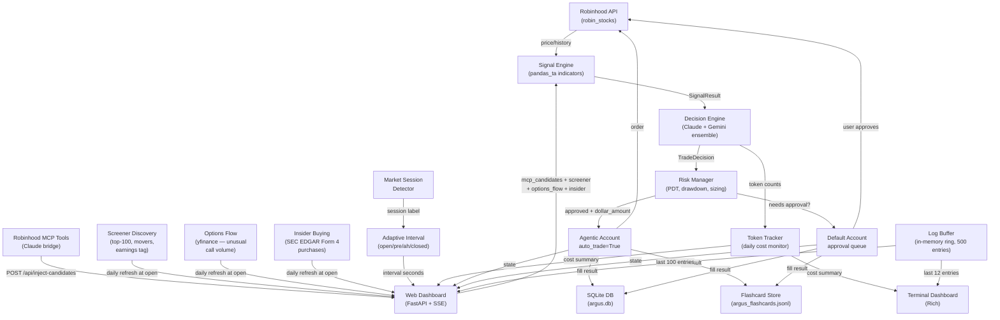
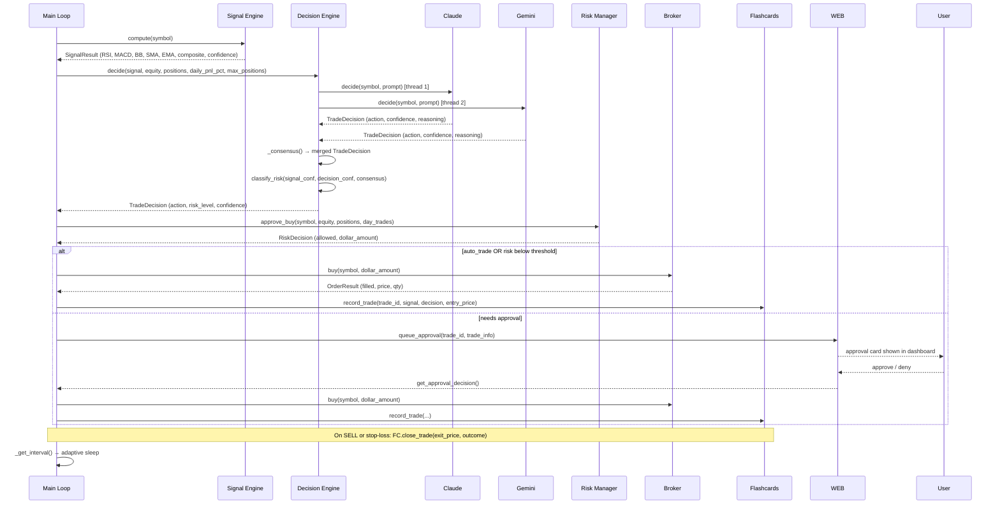
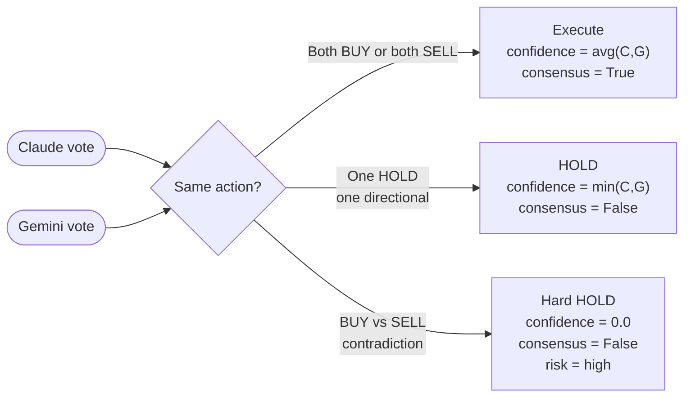
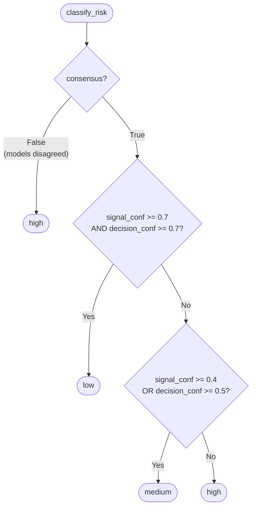
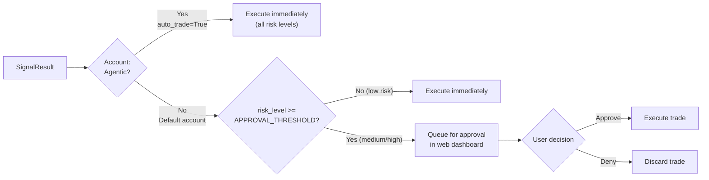

# Argus — Technical Reference

← [Back to README](../README.md)

Architecture, configuration reference, API docs, and internals for contributors and advanced users.


## 1. What is Argus?

Argus is an automated AI trading agent for Robinhood that uses a **Claude + Gemini ensemble** to make BUY/SELL/HOLD decisions from technical indicator signals. It manages two Robinhood accounts simultaneously — one fully automated (Agentic) and one requiring human approval for higher-risk trades (Default) — and surfaces everything through a real-time web dashboard and a Rich terminal UI. All scan timing adapts automatically to the current NYSE market session, with per-session intervals configurable in `.env` and overridable live from the web dashboard.

---

## 2. Python Version Compatibility

Argus requires **Python 3.12** (3.12.x recommended). Other versions are not supported:

| Version | Status | Reason |
|---------|--------|--------|
| **3.12.x** | ✅ Supported | All dependencies have binary wheels; fully tested |
| 3.11 | ❌ Not supported | `pandas-ta 0.4.71b0` and `numpy 2.x` both require `>=3.12` |
| 3.13 | ⚠️ Untested | May work, but not tested — use 3.12 for reliability |
| 3.14 | ❌ Not supported | `pandas-ta` has no binary wheels for 3.14 yet |

The `pyproject.toml` enforces this with `requires-python = ">=3.12,<3.14"`.

Install and run commands use `python3.12` / `py -3.12` explicitly — see the [README quickstart](../README.md#2-install).

The Docker image uses `python:3.12-slim` to match.

---

## 3. Architecture Overview



The main loop (`Autopilot` in `argus.engine.autopilot`) runs on an adaptive interval that changes with the NYSE market session (logic in `argus.engine.session`). On each tick it detects the current session, computes signals **in parallel** across all watchlist symbols **plus any screener/MCP/options-flow/insider candidates** (`ThreadPoolExecutor`, up to 8 workers), then runs `_tick_account` independently for each configured account.

Once per day at market open, `_refresh_screener()` runs four discovery passes in sequence: the Robinhood native screener (movers, popular, earnings), unusual options flow, SEC EDGAR insider buys, and any pending MCP-injected candidates. Results are deduplicated and merged into a single candidate pool.

---

## 4. Trade Decision Flow



At the end of each tick the loop sleeps in 1-second increments so that the countdown timer updates cleanly and `SIGINT`/`SIGTERM` are handled without delay.

---

## 5. Ensemble AI Logic

Both models receive an identical prompt containing: symbol, current price, RSI, MACD, Bollinger Bands, SMA-20, EMA-50, portfolio equity, open position count, daily P&L, and whether the symbol is already held. They run in parallel via `ThreadPoolExecutor(max_workers=2)` with a 30-second timeout per model.

**Models:**
- Claude: `claude-opus-4-8` with `thinking: {"type": "adaptive"}` (extended thinking enabled)
- Gemini: `gemini-2.0-flash` at `temperature=0.2`

Each model returns strict JSON: `{"action": "BUY"|"SELL"|"HOLD", "confidence": 0.0-1.0, "reasoning": "..."}`.



If `GEMINI_API_KEY` is absent, Argus runs Claude solo with no confidence penalty. If Gemini initialization fails at startup it degrades gracefully to Claude-only mode with a `WARNING` log entry.

The combined reasoning string (prefixed `[Claude]` / `[Gemini]`) is stored in the flashcard and shown in the web dashboard's decision log.

---

## 6. Risk Classification

After ensemble consensus, `classify_risk()` maps signal and decision confidence into a risk tier:

| `consensus` | `signal_confidence` | `decision_confidence` | Risk Level |
|-------------|--------------------|-----------------------|------------|
| `False` | any | any | **high** |
| `True` | >= 0.7 | >= 0.7 | **low** |
| `True` | >= 0.4 OR decision >= 0.5 | — | **medium** |
| `True` | < 0.4 | < 0.5 | **high** |



On the **Default account**, trades with risk >= `APPROVAL_THRESHOLD` (default: `medium`) go to the approval queue instead of executing immediately. On the **Agentic account**, all three risk levels auto-execute.

---

## 7. Account Setup

Argus manages two accounts simultaneously. Each account has its own `RobinhoodBroker` instance, its own `RiskManager` (separate drawdown/PDT tracking), and its own pending approvals dict. A single-account fallback is available if neither account number is set.

| Account | Variable | Placeholder | Mode |
|---------|----------|-------------|------|
| Agentic | `AGENTIC_ACCOUNT_NUMBER` | `your_agentic_account_number` | Fully automated (`auto_trade=True`) |
| Default | `DEFAULT_ACCOUNT_NUMBER` | `your_default_account_number` | Approval required for `medium`+ risk |



Signals and price data are computed once per tick using a shared broker instance. The resulting `SignalResult` is fed to both account ticks independently so each account's risk state is fully isolated.

---

## 8. Adaptive Scan Intervals

Argus detects the current NYSE market session and applies a different scan interval for each phase. Intervals are set in `.env` and can be overridden for the current session via the web dashboard Controls card.

| Session | Time (ET) | Default Interval | Env Var |
|---------|-----------|-----------------|---------|
| Market open | 9:30 AM – 4:00 PM Mon–Fri | 90 s | `INTERVAL_OPEN` |
| Pre-market | 4:00 AM – 9:30 AM Mon–Fri | 180 s | `INTERVAL_PREMARKET` |
| After-hours | 4:00 PM – 8:00 PM Mon–Fri | 180 s | `INTERVAL_AFTERHOURS` |
| Closed / weekend | All other times | 300 s | `INTERVAL_CLOSED` |
| Fallback | Session detection failed | 300 s | `SCAN_INTERVAL_SECONDS` |

**Web dashboard override:** The Controls card contains a dropdown that sets a manual interval for the current session only. The override is cleared on restart and Argus reverts to adaptive logic. The API accepts any value >= 15 s, but the `.env` validator enforces a minimum of 30 s for non-override paths.

> ⚠️ Setting `INTERVAL_OPEN` below 90 seconds is not recommended. Each tick calls the Robinhood API for price data, runs Claude Opus (which may take 10–25 s with extended thinking), and optionally runs Gemini in parallel. Values below 90 s risk hitting API rate limits and may cause ticks to overlap.

---

## 9. Token Usage Monitor

Every Claude and Gemini API call records its token counts through `argus/dashboard/token_tracker.py`, a thread-safe singleton that resets at midnight.

**What is tracked:**

| Model | Tokens tracked | Pricing used for estimates |
|-------|---------------|---------------------------|
| Claude (`claude-opus-4-8`) | input, output, cache read | $15.00 / $75.00 / $1.50 per million tokens |
| Gemini (`gemini-2.0-flash`) | input, output | $0.10 / $0.40 per million tokens |

Costs are **estimates** based on public pricing at the time of release. Check the Anthropic and Google AI pricing pages for current rates before using these figures for budgeting.

**Where to see it:**

- **Web dashboard** — "Token Usage Today" card shows per-model call counts, token totals, and USD cost estimates, updated live via SSE.
- **Terminal dashboard** — A compact cost summary line appears in the header beneath the mode/session badges: `Claude $X.XXXX · Gemini $X.XXXX · Total $X.XXXX`.
- **JSON API** — `GET /api/status` response includes a `token_usage` key with the full summary dict.

The tracker resets automatically when the date changes. There is no persistent storage of historical daily costs — the counter is in-memory only.

---

## 10. Configuration Reference

Non-secret settings live in `.env` (copy from `.env.example`). Secrets use the OS keychain (see §10).

### Trading Mode

| Variable | Default | Description |
|----------|---------|-------------|
| `PAPER_TRADE` | `true` | `true` = simulated orders. Set `false` for live trading. |
| `APPROVAL_THRESHOLD` | `medium` | Minimum risk level requiring human approval on the Default account (`medium` or `high`). |

### Accounts

| Variable | Default | Description |
|----------|---------|-------------|
| `ROBINHOOD_USERNAME` | — | Robinhood login email (required). |
| `AGENTIC_ACCOUNT_NUMBER` | — | Robinhood account number for the fully automated account. |
| `DEFAULT_ACCOUNT_NUMBER` | — | Robinhood account number for the approval-gated account. |

### Risk Guardrails

| Variable | Default | Description |
|----------|---------|-------------|
| `MAX_POSITION_PCT` | `0.10` | Max fraction of equity in a single position (must be 0–0.25). |
| `STOP_LOSS_PCT` | `0.05` | Hard stop-loss trigger; position closed if price drops this fraction from entry. |
| `MAX_POSITIONS` | `5` | Max concurrent open positions per account. |
| `DAILY_DRAWDOWN_LIMIT` | `-0.05` | Kill switch threshold; stops all trading if session equity drops this fraction (must be negative). |
| `MIN_CONFIDENCE` | `0.65` | Minimum ensemble confidence (0–1) to execute a BUY. Decisions below this are held regardless of signal direction. |
| `MAX_POSITION_LOSS_USD` | `75.0` | Hard dollar cap per position. If unrealized loss reaches this amount, the position is stopped regardless of `STOP_LOSS_PCT`. Prevents gap-down disasters. |

### Watchlist

| Variable | Default | Description |
|----------|---------|-------------|
| `WATCHLIST` | `AAPL,TSLA,NVDA,BTC,ETH` | Comma-separated symbols to scan on each tick. |

### Adaptive Scan Intervals

| Variable | Default | Description |
|----------|---------|-------------|
| `INTERVAL_OPEN` | `90` | Seconds between ticks during regular market hours (9:30 AM – 4:00 PM ET). |
| `INTERVAL_PREMARKET` | `180` | Seconds between ticks during pre-market (4:00 AM – 9:30 AM ET). |
| `INTERVAL_AFTERHOURS` | `180` | Seconds between ticks during after-hours (4:00 PM – 8:00 PM ET). |
| `INTERVAL_CLOSED` | `300` | Seconds between ticks when the market is closed or on weekends. |
| `SCAN_INTERVAL_SECONDS` | `300` | Fallback interval used if session detection fails. Minimum 30 s. |

### Web Dashboard

| Variable | Default | Description |
|----------|---------|-------------|
| `WEB_HOST` | `127.0.0.1` | Bind address; use `0.0.0.0` only behind an auth proxy. |
| `WEB_PORT` | `8000` | Port for the FastAPI web server. |
| `DASHBOARD_TOKEN` | *(empty)* | If set, all mutating API endpoints require an `X-Argus-Token: <value>` header. The token is embedded in the served HTML at page load so the browser sends it automatically. Read-only endpoints and SSE are not gated. Strongly recommended when `WEB_HOST=0.0.0.0`. |
| `DATABASE_URL` | `sqlite:///argus.db` | SQLAlchemy connection string for trade history. |

### Notifications

| Variable | Default | Description |
|----------|---------|-------------|
| `NOTIFY_EMAIL` | — | Recipient address for email alerts. |
| `SMTP_HOST` | `smtp.gmail.com` | SMTP server host. |
| `SMTP_PORT` | `587` | SMTP port. |
| `SMTP_USER` | — | SMTP login (sender address). |
| `TWILIO_ACCOUNT_SID` | — | Twilio Account SID for SMS alerts. |
| `TWILIO_FROM` | — | Twilio source phone number (E.164 format). |
| `TWILIO_TO` | — | Destination phone number for SMS (E.164 format). |
| `SLACK_CHANNEL` | `#argus-alerts` | Slack channel for trade notifications. |

---

## 11. Secrets & Keychain

Secrets are never stored in `.env` or committed to source control. Argus uses the OS keychain (macOS Keychain, Windows Credential Manager, or Linux Secret Service via `keyring`). On startup, `config.py` loads secrets through `_KeychainSource` before falling through to `.env`.

**Priority order (highest to lowest):** environment variable → OS keychain → `.env` → default

Run `argus-setup` once after install to populate the keychain interactively. Re-run any time to rotate a key.

```
argus-setup           # store / update all secrets (interactive prompts)
argus-setup --show    # display which secrets are stored (values masked)
argus-setup --clear   # remove all Argus secrets from keychain
```

| Key | Required | Description |
|-----|----------|-------------|
| `ANTHROPIC_API_KEY` | **Required** | Anthropic API key for Claude Opus. |
| `GEMINI_API_KEY` | Optional | Google Gemini API key; omit to run Claude-only. |
| `ROBINHOOD_PASSWORD` | **Required** | Robinhood account password. |
| `ROBINHOOD_MFA_SECRET` | Optional | TOTP secret for Robinhood 2FA (base32 string from the authenticator setup page). |
| `SMTP_PASSWORD` | Optional | Gmail app password or SMTP credential for email alerts. |
| `TWILIO_AUTH_TOKEN` | Optional | Twilio auth token for SMS notifications. |
| `SLACK_BOT_TOKEN` | Optional | Slack bot token (`xoxb-...`) for channel notifications. |

> ⚠️ MFA sessions are never persisted to disk (`store_session=False`). The TOTP secret is cleared from memory immediately after generating the login code.

---

## 12. Branding Assets

Static files are served by FastAPI at `/static` and live in `argus/dashboard/static/`.

| File | Size | Used in |
|------|------|---------|
| `icon.png` | 1024×1024 | Source for all derivatives |
| `favicon-32x32.png` | 32×32 | Browser tab |
| `favicon-16x16.png` | 16×16 | Browser tab (small) |
| `apple-touch-icon.png` | 180×180 | Mobile bookmark |
| `logo-horizontal.png` | 2112×496 | Reference horizontal lockup |
| `banner.png` | 1456×720 | README / GitHub social preview |

The dashboard header renders the icon inline with the "ARGUS" wordmark using `mix-blend-mode: screen` so the transparent PNG background vanishes against the dark surface.

---

## 13. CLI Commands

These shell functions are defined in `~/.zshrc` and require `ARGUS_DIR` to point to the project root.

| Alias | Description |
|-------|-------------|
| `argus-tmux` | **Start here.** Creates (or re-attaches to) a `tmux` session named `argus` running the full terminal UI and web dashboard. Re-run from any terminal to re-attach. |
| `argus-start` | Foreground start with terminal UI. Exits when the terminal closes. |
| `argus-bg` | Background start (no terminal UI). Logs to `~/argus.log`. Writes PID to `~/argus.pid`. |
| `argus-restart` | **Full clean restart.** Kills the process, destroys the tmux session, and starts a fresh one. Handles being run from inside tmux via `switch-client`. |
| `argus-stop` | Graceful shutdown. Kills by PID file, port 8000 process, and process name — works regardless of how Argus was started. |
| `argus-status` | Checks if Argus is running by polling `/api/status`. Prints equity and P&L if up, or a start instruction if down. |
| `argus-log` | `tail -f ~/argus.log` — follows the live log file for `argus-bg` and `argus-tmux` runs. |
| `argus-open` | Opens `http://127.0.0.1:8000` in the default browser. |
| `argus-mock` | Runs `dev_mock.py` — a fake-data UI server for development. No Robinhood connection required. |
| `argus-setup` | Launches the interactive keychain setup wizard to store or rotate secrets. |

---

## 14. Web Dashboard

The dashboard is a single-page app served by FastAPI at `http://127.0.0.1:8000`. State is pushed from the main loop to the browser via **Server-Sent Events** (`/events`) on every tick, so all panels update live without client-side polling. On first connect the browser receives a snapshot of the latest state immediately.

The dashboard has two tabs: **Dashboard** (live trading view) and **Performance** (analytics).

---

### Dashboard Tab

#### Token Usage Today

First card at the top. Shows per-model API usage since midnight: call count, input/output tokens (and cache-read tokens for Claude), and estimated USD cost. Resets at midnight. Total combined cost at the bottom.

#### Account Panels

Two side-by-side cards, one per account. **Agentic** uses cyan borders; **Default** uses purple. Each panel shows: equity, daily P&L, day trade count (highlighted yellow at 2/3), mode (`AUTO` vs `APPROVAL`), open positions with unrealized P&L %, the five most recent trades, and a **$25K PDT Goal** progress bar.

#### $25K PDT Goal

Each account panel shows a gradient progress bar toward the `EQUITY_GOAL` (default `$25,000` — the threshold at which the FINRA PDT restriction is lifted). Configurable via the `EQUITY_GOAL` env var. The bar turns green and shows "PDT restriction lifted" once the goal is reached.

#### Price Chart

Interactive chart per watchlisted symbol. Pulls one month of daily OHLCV data via `GET /api/chart/{symbol}`. Features:
- **Candlestick / Line toggle** — switch rendering style without reloading.
- **Linear regression prediction line** — trend projection overlaid on the chart.
- **Trade markers** — buy and sell executions plotted as arrows on the chart.

#### Pending Approvals

Yellow cards for every Default-account trade queued for human approval. Each card shows symbol, dollar amount, risk level, AI confidence, and full AI reasoning. Buttons: **Approve** (`POST /api/approve/{trade_id}`) or **Deny** (`POST /api/deny/{trade_id}`).

#### Open Positions

Table of all open positions across both accounts: symbol, account, quantity, entry price, current price, stop-loss, and unrealized P&L %. Two action buttons per row:
- **Close** — force-closes the position immediately (`POST /api/close/{symbol}`)
- **Promote ↑** *(Default positions only)* — sells the position on Default and re-buys the equivalent dollar amount on Agentic (`POST /api/promote/{symbol}`). Use this to gradually shift trusted positions to the auto-trade account.

#### Signals

Latest `SignalResult` per watchlisted symbol: price, RSI, MACD histogram, composite direction (BULLISH / BEARISH / NEUTRAL, color-coded), and confidence.

#### Recent Trades

Chronological list of executed orders from the current session: time, symbol, account, side, quantity, fill price.

#### Decision Flashcards

Grid of cards from `argus_flashcards.jsonl`, designed for non-technical review. Each card face shows: the symbol + action (BUY/SELL pill), how long ago the trade was made, the AI's confidence level in plain English (e.g. "Low-risk trade — AI was 78% confident"), and a quote-style excerpt of the AI's reasoning. Click any card to expand the full explanation in two sections: "Why the AI decided this" (full reasoning) and "Market conditions at the time" with plain-English labels (Momentum, Trend strength, Price range, vs 20-day average, vs 50-day trend line, Overall signal). Closed trades show the dollar outcome (e.g. "▲ Made +$2.81 (+5.62%)") and hold duration. Open trades show "In progress · opened Xh ago".

#### Agent Log

Real-time log tail (last 100 entries) from the in-memory ring buffer. Color-coded by level. Auto-scrolls. Filterable by level.

---

### Performance Tab

Populated from `FlashcardStore.performance()` on every state update. Resets as new trades close.

#### Overall Performance

Six stat cards:

| Card | Description |
|------|-------------|
| Win Rate | % of closed trades that were profitable |
| Avg P&L | Average P&L % per closed trade |
| Streak | Current consecutive win or loss streak count |
| Avg Hold | Average position hold time in hours |
| Best Trade | Symbol, P&L %, and date of best closed trade |
| Worst Trade | Symbol, P&L %, and date of worst closed trade |

#### By Symbol

Per-symbol table: total trades, wins, win rate, average P&L %. Identifies which stocks in the watchlist are performing well vs. dragging returns.

#### AI Confidence Accuracy

Win rate broken down by the ensemble's decision confidence at trade time:

| Bucket | Threshold |
|--------|-----------|
| High | ≥ 70% |
| Medium | 50–69% |
| Low | < 50% |

Use this to tune `classify_risk()` thresholds and understand whether high-confidence calls actually outperform.

---

## 15. Flashcard Learning System

Every executed trade (buy or sell) produces a flashcard. Cards are stored in `argus_flashcards.jsonl` (one JSON object per line) in the project root. The `FlashcardStore` loads all cards into memory at startup and flushes to disk atomically on every write: it writes to a temp file in the same directory, then `os.replace()`s it into place, so a crash mid-write can never produce a corrupt file. The file is `chmod 0600` after each flush.

**On trade entry (`FlashcardStore.record_trade`)**, the card captures:

| Field | What it records |
|-------|----------------|
| `signal_composite` | `bullish` / `bearish` / `neutral` at decision time |
| `signal_confidence` | Fraction of indicators in agreement (0–1) |
| `rsi` | RSI-14 value |
| `macd_hist` | MACD histogram value (sign indicates momentum direction) |
| `bb_position` | `above_upper` / `below_lower` / `inside` |
| `price_vs_sma20` | `above` or `below` the 20-day simple moving average |
| `price_vs_ema50` | `above` or `below` the 50-day exponential moving average |
| `risk_level` | `low` / `medium` / `high` from the ensemble |
| `decision_confidence` | Averaged AI confidence (0–1) |
| `reasoning` | Full concatenated Claude + Gemini reasoning |
| `entry_price` | Actual fill price |
| `dollar_amount` | Position size in dollars |

**On trade close (`FlashcardStore.close_trade`)**, the card is updated with:

| Field | What it records |
|-------|----------------|
| `exit_price` | Fill price on sell or stop-loss |
| `pnl_pct` | `(exit - entry) / entry * 100` |
| `outcome` | `win`, `loss`, or `stop-loss` |
| `hold_duration_hours` | Time from entry to exit in fractional hours |

**Aggregate stats** are available via `FlashcardStore.summary()` — win rate, average P&L %, best trade, and worst trade — displayed in the web dashboard flashcard panel header.

For custom analysis, load the JSONL file directly:

```python
import json
from pathlib import Path

cards = [json.loads(l) for l in Path("argus_flashcards.jsonl").read_text().splitlines() if l]
closed = [c for c in cards if c["pnl_pct"] is not None]

# Example: which RSI ranges correlate with wins?
wins = [c for c in closed if c["pnl_pct"] > 0]
```

Look for patterns in: which `bb_position` + `signal_composite` combinations win most, whether high `decision_confidence` predicts positive P&L, and which symbols produce the best outcomes.

---

## 16. Paper Mode vs Live

### Paper Mode (`PAPER_TRADE=true`)

- Each account broker starts with a simulated `$10,000` cash balance (separate per broker instance).
- `buy()` deducts from the simulated balance and records a synthetic position; `sell()` returns proceeds to the balance.
- Price data is still fetched live from Robinhood for realistic signal computation.
- Orders never reach Robinhood's order management system.
- All other features (flashcards, signals, approvals, notifications, database, token tracker) work identically to live mode.

### Live Mode (`PAPER_TRADE=false`)

- Each account broker authenticates to Robinhood at startup using real account credentials.
- `buy()` calls `rh.orders.order_buy_fractional_by_quantity` (equities) or `order_buy_crypto_by_quantity` (crypto).
- Fractional shares are supported, so any dollar amount works regardless of share price.
- Sessions are never cached to disk (`store_session=False`). The TOTP code is computed fresh each startup and the MFA secret is cleared from memory immediately after.

### Go-Live Readiness Scorecard

Argus now includes an automated **Go-Live Readiness Scorecard** in the **Performance** tab. This system removes the guesswork from deploying real capital by requiring statistical proof of edge:

1.  **Sample Size**: Minimum 30 closed trades for statistical significance.
2.  **Profit Factor**: Gross Profit / Gross Loss ratio of > 1.5.
3.  **Calibration**: Proof that "High Confidence" AI trades outperform "Low Confidence" ones.
4.  **Token Efficiency**: Net paper profit must exceed lifetime API (Claude/Gemini) costs.
5.  **AI Ensemble Audit**: Claude and Gemini must independently review your paper performance and vote "YES" to going live.

Only when all metrics are green and the AI Ensemble reaches consensus will the system display the **READY FOR LIVE TRADING** status.

### Go-Live Checklist

Before setting `PAPER_TRADE=false`, verify all of the following in paper mode:

- [ ] **Go-Live Readiness Scorecard** in the dashboard is 100% green.
- [ ] **AI Ensemble Audit** has returned a consensus "YES" vote.
- [ ] At least 5 full trading days completed without crashes.
- [ ] Kill switch has triggered and recovered correctly at least once.
- [ ] Approval flow on Default account tested end-to-end (both approve and deny paths).
- [ ] Stop-loss sweep confirmed to close positions automatically.
- [ ] `argus-status` shows correct equity and P&L after each session.
- [ ] Notifications (email / SMS / Slack) delivering correctly.
- [ ] `DAILY_DRAWDOWN_LIMIT` set conservatively (e.g., `-0.02` for the first live week).

> ⚠️ Start with the Agentic account (smaller balance) for the first live week before trusting the Default account's approval flow with larger positions.

---

## 17. Docker Deployment

Argus ships with a `Dockerfile` and `docker-compose.yml` for running on any machine (Mac Mini, Linux server) without managing a Python environment.

### How it works

| Concern | Approach |
|---------|----------|
| Source code | Copied into `/app` inside the image |
| Runtime data (SQLite, flashcards) | Written to `/data` — mounted as a named Docker volume |
| Secrets | Injected from host environment variables at runtime — never baked into the image |
| Terminal UI | Disabled automatically (`ARGUS_NO_TERMINAL=1`) — web dashboard is the interface |
| Port | `8000` mapped to host `8000` |
| Auto-restart | `restart: unless-stopped` — survives Mac Mini reboots |

### Quick start

```bash
# 1. Export secrets in your shell (add to ~/.zshrc for persistence)
export ANTHROPIC_API_KEY="your_key"
export ROBINHOOD_PASSWORD="your_password"
export GEMINI_API_KEY="your_key"          # optional
export ROBINHOOD_MFA_SECRET="your_secret" # optional

# 2. Copy config
cp .env.example .env   # edit watchlist, intervals, account numbers

# 3. Build and run
docker compose up -d

# 4. Check status
docker compose ps
curl http://localhost:8000/api/status
```

### Useful commands

```bash
docker compose up -d          # start in background
docker compose down           # stop
docker compose restart argus  # restart without rebuild
docker compose logs -f        # follow live logs
docker compose up -d --build  # rebuild after code changes
```

### Remote access (Mac Mini + Tailscale)

Install Tailscale on both the Mac Mini and your iPhone. Once connected, access the dashboard from anywhere via the Mac Mini's Tailscale IP — no open ports, no public internet exposure:

```
http://100.x.x.x:8000
```

Full step-by-step migration checklist: [`mac-mini-setup.md`](mac-mini-setup.md)

---

## 18. Market Intelligence Screeners

`argus/screener/market_intelligence.py` provides two additional discovery feeds that run once per day at market open alongside the native Robinhood screener. Both are integrated in `Autopilot._refresh_screener()` and deduplicated before being added to the signal universe. The AI ensemble still makes the final BUY/SELL/HOLD decision.

### 18a. Unusual Options Flow

Scans the combined watchlist + daily screener universe via **yfinance options chains**. For each symbol, it pulls the nearest expiry and computes:

| Metric | Threshold | Signal |
|--------|-----------|--------|
| Call volume / Call open interest | > 30% | Unusual — 30%+ of all open calls traded today |
| Call volume / Put volume | > 2.5× | Bullish skew — calls outpace puts by 2.5:1 |

Both the `call_vol ≥ 500` minimum and either threshold above must be met for a symbol to be flagged. The scan runs with `ThreadPoolExecutor(max_workers=8)` and a 12-second timeout per symbol. Symbols are added to the screener candidate pool with `category="options_flow"`.

**Why this matters:** Large institutional orders often show up as unusual options activity 1–3 days before the underlying moves. The call/OI ratio is particularly reliable because most retail traders do not turn over 30%+ of all open interest in a single session.

### 18b. SEC EDGAR Insider Buying

Fetches recent **Form 4 filings** (insider transaction reports) from the SEC EDGAR full-text search API and filters for open-market purchases only.

**Pipeline:**

```
1. EDGAR EFTS API  →  all Form 4 filings in the last 3 days
   GET https://efts.sec.gov/LATEST/search-index
       ?forms=4&dateRange=custom&startdt=...&enddt=...

2. For each filing:
   a. Parse _source.ciks[] to identify insider CIK vs issuer CIK
      (insider CIK matches the accession number prefix)
   b. Look up issuer ticker: SEC company tickers JSON
      https://www.sec.gov/files/company_tickers.json  (cached in memory)
   c. Resolve primary XML filename: data.sec.gov/submissions/CIK{insider}.json
      (LRU-cached per CIK — multiple filings from the same insider share one fetch)
   d. Download Form 4 XML from Archives/edgar/data/{cik}/{acc}/{doc}.xml
   e. Confirm <transactionCode>P</transactionCode>  (purchase, not grant/award/sale)

3. Aggregate by issuer ticker — count distinct insiders per symbol
4. Sort by count descending — multiple insiders buying = stronger signal
```

Rate limiting: a module-level `threading.Lock` enforces a minimum 0.12 s gap between all EDGAR requests (≈8 req/s, within EDGAR's 10 req/s policy). Parallel XML fetches use `ThreadPoolExecutor(max_workers=5)`.

Symbols are added with `category="insider"` and a reason string like `"SEC Form 4: 2 insiders purchased shares (last 3d)"`.

**Why this works:** Insider selling is noisy (diversification, tax planning), but insider buying is almost always conviction. Executives and directors buy their own stock when they believe it is undervalued. Clustering (multiple insiders buying in the same week) is among the strongest publicly-available signals in equities research.

---

## 19. MCP Bridge — Market Discovery

Argus watches more than just its static watchlist. Market discovery runs via two parallel mechanisms:

### Native Screener (automatic, runs every market open)

`broker/robinhood.py → get_screener_symbols()` pulls from Robinhood's live API on each daily session start:

| Source | Count | Category |
|--------|-------|----------|
| Robinhood 100 Most Popular | top 40 | `popular` |
| Robinhood top 20 daily movers | top 20 | `mover` |
| S&P 500 top movers (up + down) | top 5 each | `mover` |
| Upcoming earnings tag | top 30 | `earnings` |
| Per-symbol earnings check for movers | all movers | upgrades to `earnings` |

Discovered symbols are added to the scan universe for the session but not persisted to the watchlist. They expire when Argus restarts.

### Claude MCP Bridge (on-demand, Claude-curated)

Claude Code (the AI running this project) has direct access to the Robinhood MCP server tools, which expose richer intelligence than `robin_stocks` alone — notably the full earnings calendar, fundamentals, and community watchlists. The bridge connects this to Argus via a REST API:

**Inject candidates** (authenticated):
```bash
curl -X POST http://127.0.0.1:8000/api/inject-candidates \
  -H "X-Argus-Token: $DASHBOARD_TOKEN" \
  -H "Content-Type: application/json" \
  -d '{
    "candidates": [
      {"symbol": "NFLX", "reason": "Earnings July 16 PM, near 52-wk low", "category": "earnings", "ttl_hours": 96},
      {"symbol": "PLTR", "reason": "Robinhood 100 Most Popular, AI momentum", "category": "popular", "ttl_hours": 24}
    ]
  }'
```

**Check the queue** (unauthenticated):
```bash
curl http://127.0.0.1:8000/api/mcp-candidates
```

**Clear the queue** (authenticated):
```bash
curl -X DELETE http://127.0.0.1:8000/api/mcp-candidates \
  -H "X-Argus-Token: $DASHBOARD_TOKEN"
```

**TTL behaviour:** Each candidate carries a `ttl_hours` value (default 8). Expired entries are pruned automatically on every read — no manual cleanup needed. Typical values: 24h for movers/popular, 48–96h for earnings catalysts (so the position has time to build into the event).

**What the autopilot does with them:** On each scan tick, `web_dashboard.get_mcp_candidates()` returns unexpired candidates. These are added to the signal computation pool (same `ThreadPoolExecutor` as the watchlist), and if technical signals + AI ensemble agree, they trade exactly like watchlist symbols — same confidence gate, same risk checks, same stop-loss.

---

## 20. CI/CD Pipeline

Every push to `main` and every pull request runs the full automated quality and security suite defined in `.github/workflows/`.

### Workflows

| Workflow | File | Trigger | What it checks |
|----------|------|---------|----------------|
| **CI** | `ci.yml` | push / PR | ruff lint, bandit security scan, pytest |
| **CodeQL** | `codeql.yml` | push / PR / weekly Monday | Deep Python static analysis (taint, injection, path traversal) |
| **Claude Code Review** | `claude-review.yml` | PR open / sync | AI review: trading safety, credential exposure, correctness bugs |

### CI — lint and test

Uses `ruff` for fast style + correctness checks and `bandit` for Python-specific security patterns (hardcoded secrets, shell injection, insecure hashing). Test suite runs with `pytest`. Tests are currently sparse — CI marks the pytest step `continue-on-error` so they don't block PRs, but they will fail loudly in the log.

Run locally before opening a PR:
```bash
pip install ruff bandit
ruff check argus/
bandit -r argus/ -ll --exclude argus/dashboard/static
pytest tests/ -v
```

### CodeQL

GitHub's CodeQL analyzes the Python AST and data-flow graph for SAST issues — SQL injection, path traversal, taint from external inputs into sensitive sinks, and more. Runs as a GitHub-hosted runner and posts findings to the **Security → Code scanning** tab. Also runs on a weekly cron (every Monday 8 AM UTC) to catch issues introduced by dependency updates even if no code changed.

### Claude Code Review

Every PR is automatically reviewed by Claude via `anthropic/claude-code-action@beta`. The review is focused on Argus-specific risk:

- **Trading safety** — anything that could trigger an unintended real-money order, bypass `PAPER_TRADE`, skip the stop-loss sweep, or ignore the kill switch
- **Credential exposure** — API keys, Robinhood credentials, or TOTP secrets accidentally referenced in logs or HTTP responses
- **EDGAR/yfinance correctness** — rate limit compliance, correct field parsing, XML edge cases
- **Correctness bugs** — race conditions in the thread pool, None handling, off-by-one in position sizing

Claude posts findings as inline PR comments. Requires `ANTHROPIC_API_KEY` stored as a repository secret.

### Dependabot

`dependabot.yml` opens PRs every Monday for:
- `pip` package updates (CVE fixes, minor/patch bumps)
- GitHub Actions version updates

`anthropic` and `robin-stocks` major-version bumps are excluded from auto-PRs — those are breaking changes requiring manual review.

### Branch protection (configure in GitHub Settings → Branches)

Required for `main`:
- **Require pull request before merging**
- **Require status checks:** `lint-and-test`, `Analyze (Python)`
- **Dismiss stale reviews** when new commits are pushed
- **Do not allow bypassing** the above settings

### Security disclosure

See [SECURITY.md](../SECURITY.md) for the vulnerability disclosure policy. GitHub secret scanning is enabled automatically on public repositories and emails the owner within minutes if a key is accidentally committed.

---

## 21. Directory Structure

```
argus/
├── .env                          # Non-secret config (copy from .env.example)
├── .env.example                  # Template with all supported variables
├── start.sh                      # Standard start/stop/restart/status script
├── Dockerfile                    # python:3.12-slim; source in /app; data at /data
├── docker-compose.yml            # Service definition; secrets from host env; named volume
├── .dockerignore                 # Excludes .venv, .env, db, logs from image
├── pyproject.toml                # Package definition and dependencies
├── CHANGELOG.md                  # Version history
├── SECURITY.md                   # Vulnerability disclosure policy and security design notes
├── argus.db                      # SQLite trade history (created at runtime)
├── argus.log                     # Rolling log file (created at runtime)
├── argus_flashcards.jsonl        # Trade decision flashcards (created at runtime)
│
├── .github/
│   ├── dependabot.yml            # Weekly pip + Actions dependency update PRs
│   └── workflows/
│       ├── ci.yml                # ruff lint + bandit security scan + pytest
│       ├── codeql.yml            # GitHub CodeQL Python static analysis
│       └── claude-review.yml     # Automated PR review via claude-code-action@beta
│
├── docs/
│   ├── technical.md              # This document — architecture, config, API reference
│   └── mac-mini-setup.md         # Step-by-step Mac Mini + Docker migration checklist
│
└── argus/                        # Main package
    ├── __init__.py               # Package version (__version__ = "0.6.1")
    ├── main.py                   # Main entry point; CLI wrapper
    ├── config.py                 # Pydantic settings; keychain source; priority chain
    ├── secrets.py                # OS keychain read/write via keyring
    ├── setup_secrets.py          # argus-setup interactive CLI
    ├── install_service.py        # argus-service macOS launchd / systemd installer
    │
    ├── engine/
    │   ├── autopilot.py          # Autopilot orchestration loop; AccountContext
    │   └── session.py            # Market session detection and adaptive intervals
    │
    ├── agent/
    │   └── decision.py           # DecisionEngine; AI consensus logic; AI Go-Live Audit
    │
    ├── broker/
    │   └── robinhood.py          # RobinhoodBroker; paper simulation; live order execution
    │
    ├── screener/
    │   ├── __init__.py           # Package init
    │   └── market_intelligence.py  # Unusual options flow (yfinance) + SEC EDGAR insider buying
    │
    ├── strategy/
    │   └── indicators.py         # SignalEngine; Strategy Pattern; pandas_ta indicators
    │
    ├── risk/
    │   └── manager.py            # RiskManager; PDT tracking; drawdown kill switch; stop-loss
    │
    ├── dashboard/
    │   ├── web.py                # FastAPI app; SSE stream; advanced charting; HTML UI
    │   ├── terminal.py           # Rich terminal dashboard; NullTerminalDashboard
    │   ├── token_tracker.py      # Lifetime cost tracking; ROI calculation
    │   └── log_buffer.py         # In-memory log ring buffer (500 entries)
    │
    ├── learning/
    │   └── flashcards.py         # FlashcardStore; Readiness Scorecard logic
    │
    ├── notifications/
    │   └── notifier.py           # Notifier; email (aiosmtplib); SMS (Twilio); Slack
    │
    └── storage/
        └── models.py             # SQLAlchemy models; Persistent Watchlist; Trade history
```
